# Magical Siege

This is the final update! #)

week 14 update (Cant belive siege is ending...) the awesome wrapup! : 

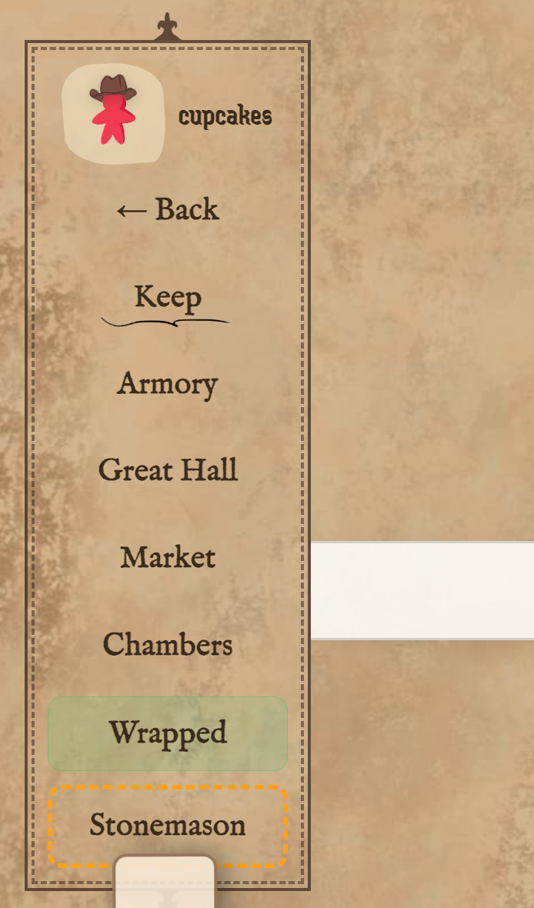

What i did this week -> For this week, I made countless number of wrapped versions, and tried to integrate them with the extension as well as I tried countless number of ways to make it as awesome as possible but apis made me mad as hell, idk how am i alive after being tortured this long :cryin but yeah this is finally over and i am happy with it :)

have a cupcake :cupcakes

week 13 update : 

https://github.com/user-attachments/assets/3e16cd3e-8a83-4651-b3a6-edd8bef69ee6

Claim your free cosmetic of this week "The cool Sailor's Hat" !!

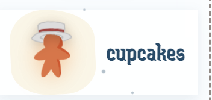

What i did this week -> For this week, I tried to make a cozy winter theme, I implemented snowy bg with snowfall and also snow accumulation in the footer and also tried my hands at frosted glass ui (ik its bad but yeaa, I just came back from exam lol!) Other than that I have updated the lb to go full lb now :yayay , also I fixed a lot of bugs this week, which were making magical siege a funny one :hehe

Also, I have planned something super awesome for the final week, I cant wait for y'all to see it #)

week 12 update : 

https://github.com/user-attachments/assets/a3c982c0-e458-40a1-b42d-c4f1a636d798

First of all before I begin to explain the main xray machine, from this week onwards I will be giving free cosmetics each week, for week 12 I have unlocked cowboyhat for free for you :)!!
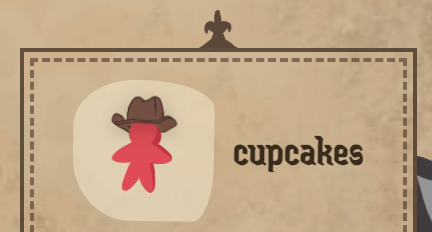

What i did this week -> For this week, I made an awesome X-ray machine for both siegers and reviewers, Now you get a x-ray button on each project card and with which you can run a deep scan on the project to uncover its hidden framework behind it, I literally gave up this time building it, because I was not able to implement it anywhere apart from armory page, bec olive hasnt updated code still, so I tried like 100 times with diff strategies to inject this thing in great hall and stonemason page!!

Howdy Liege! hope you like this weeks update!!

here are some snapshots as gif just doesnt justify the quality!!

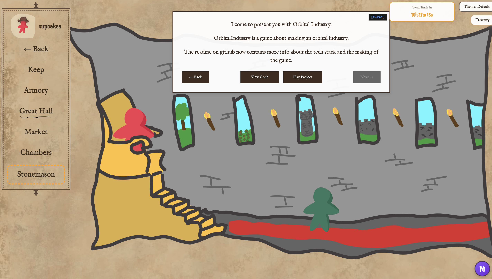
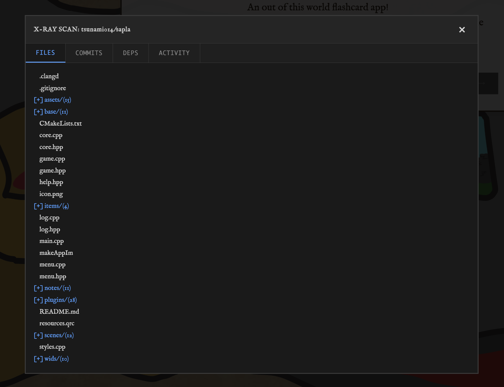

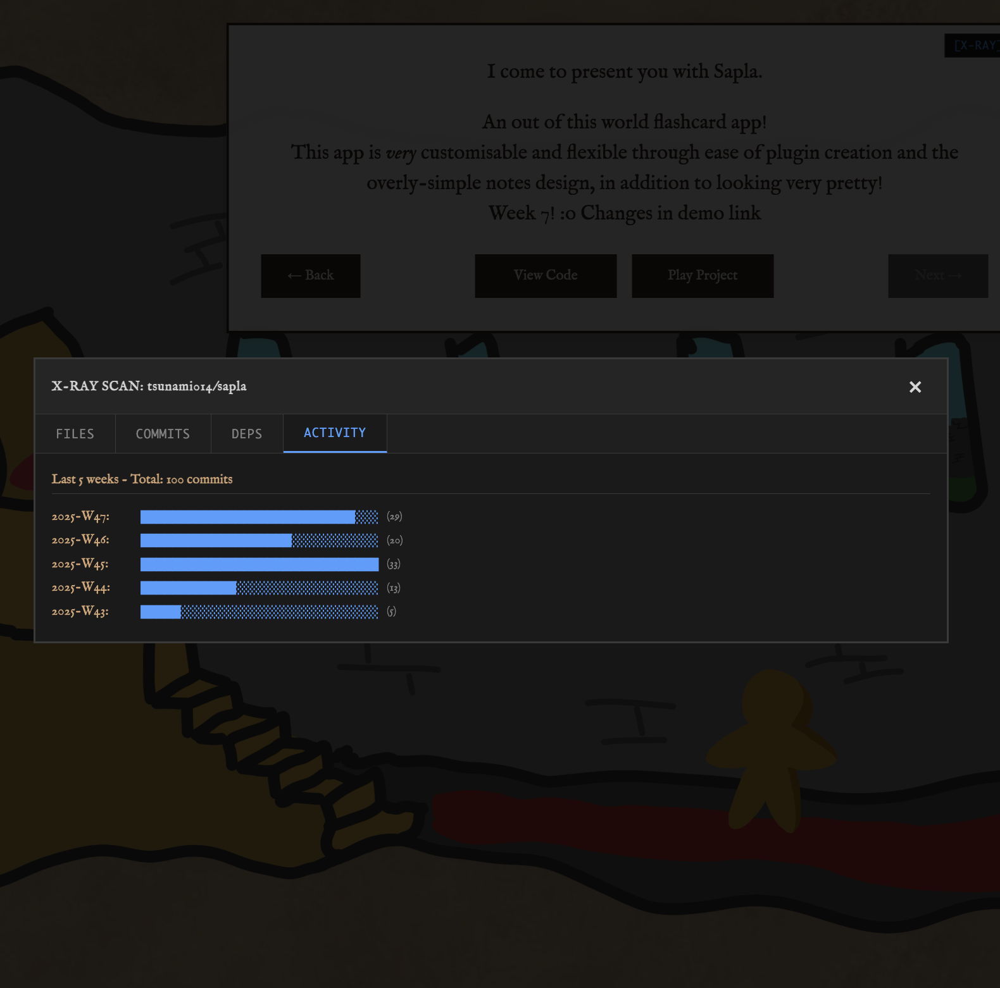

week 11 update :

LORE > [Couldnt do as much as i had hoped (I had mocks lined up this week and i am gonna be cooked in following three weeks as well :cryin)] 

What i did this week -> I made space theme with starry sky (yup its so calmin that i stare at siege website now!!) for this week, which surprisingly I made better than the bluprint i had thought of, it took some time but definitely worth it, also i managed to integrate a small space shooter inspired cursor game, where you can shoot falling projects with your gun ship (cursor!) :cupcakes!!

I know this is grainy and low quality gif, but to show gif here i had to compress it, if want to see it in real, you can install the extension or if you are lazy, go tto demo-assets and watch space.mp4 video there!!

week 10 update :

What i did -> is that i made a treasury managing grid which is inspired by refineing work in severence, once you click treasury button, you become treasurer and you have to process siege treasury by processing coins in the grid!

I had many awesome ideas and plans for this week, but unfortunately I was very busy giving mocks back to back :sob: so couldnt really implement all of the features i planned, but still i consider it has turned out to be great, give it a try, and always remember since you are a treasurer now that work is mysterious and improtant!!

week 9 update:
Olive rewrote the code and my extension broke, i had to spend so much time figuring how to fix it, going blind as i dont have access to updated code yet, so i used popstate to handle turbo fires, kinda rebuilt the extension then moved on to fix some pending broken things, and finally (even i cant believe this turned out to be so good) the dark theme is now spooky as hell, i would suggest you to follow the dot!! 

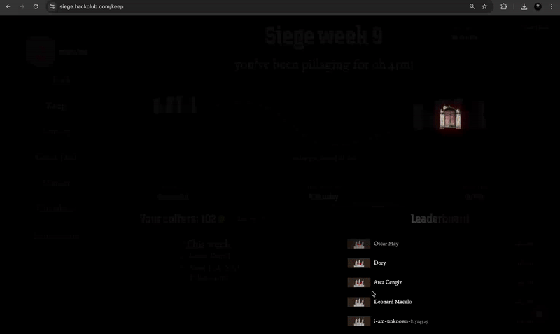

if you want full demo

(also i am proud of myself i didnt buy any merc this week nor begged for coins lol! :)_

It's 2 am now cupcakes signin off... Happy Halloween!

week 8 update:
I have fixed the issues created duw to olive rewriting some code in og website, made armory upgrades, fixed the broken structure, and most importantly now lb uses api to fetch top 50, and then counts you (if you are not in top 50), also added search in explore page, and most amazing update in this version that i personally love is falling projects, they turned out to be so cool, you can clickable as well, hope you all like this update (prolly a final one!)

tysm for the support rino (only user apart from me lol!) click below for demo vid

video demo:

This is a Chrome extension that transforms the Siege experience into a magical one, i have invested a lot of time in hit and trial, by trying out different ui upgrades and features, dug too deep into siege code for that :cryin: but good thing is that I have fairly good idea about siege web structure now, after multiple versions and trials, I have kinda accepted how keep and armory page have been upgraded as of now, I have also tried to make a magical theme for the website do try it out, I'll keep working on this one, to make it much more useful and upgrade siege into truly a magical experience :)

what I improved in week 7 (signal theme):
I improved themes (dont tell Olive but in magical theme you get orange meeple for free with this one :lol), added a coffers leaderboard, and a poke(signal) feature to poke others, sadly I was out this week so couldn't work much as I wanted to! Now that apis are finally out, I can't wait to use them in week 8, here are some snapshots!

---

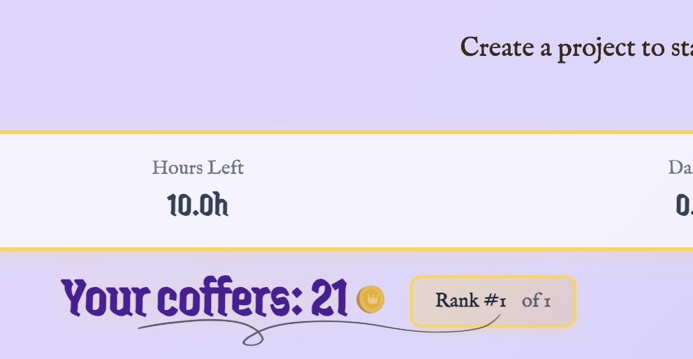

---

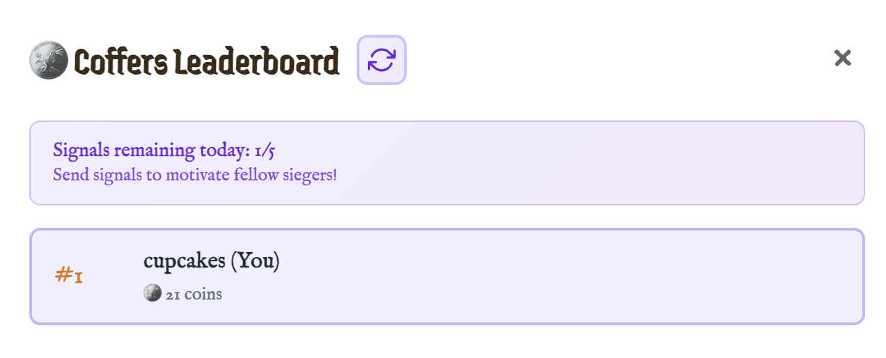

---

---

Old readme (upto week 6)
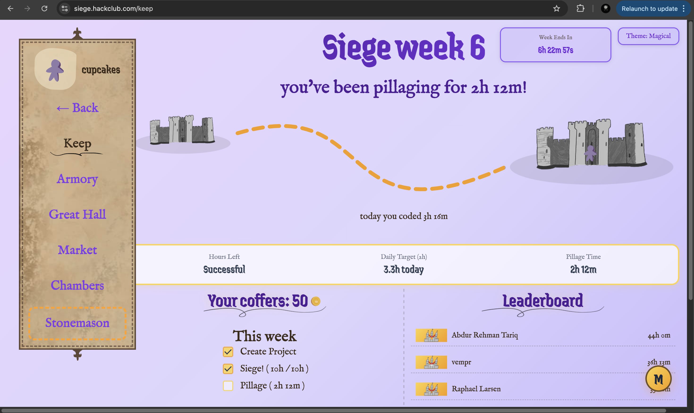

---

## Features as of now (Implemented succesfully)

### Magical themes
I have implemented two more themes, magical and a dark theme do check them out :)

### Live Deadline Countdown
A live countdown according to edt, to keep you on your feet :)

### Better stats on keep
I have tried to improved the stats in keep page, so that you have better experience sieging!

### Armory upgrades
Armory page is upgraded now with predicted coins, and project stats that will help you, It's still work in progress, i am working on more features

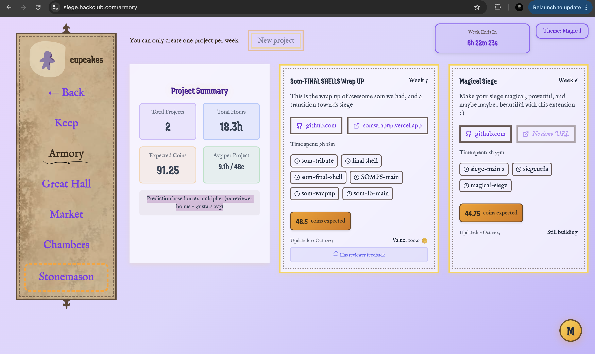

### Keyboard shortcuts
yeah i added some keyboard shortcut as well, idk how they are better, but it seemed cool to me :)

## Future (yet to be implemented)

I did try some of these but they were broken, so I am not shipping them yet!

### Voting Tools
Vote faster and fairer with ai detection, and ai comparison for all projects for maybe better star rating

### shop upgrades
I maybe able to give some shop items for free (Olive dont kill me for that :hehe:) also a better shop layout maybe

---

## Installation

### Manual Installation (Development mode in chrome)
1. Download extension from gh releases and extract it
4. Open Chrome and go to `chrome://extensions/`
5. Enable "Developer mode"
6. Click "Load unpacked"
7. Select the `extracted` folder
