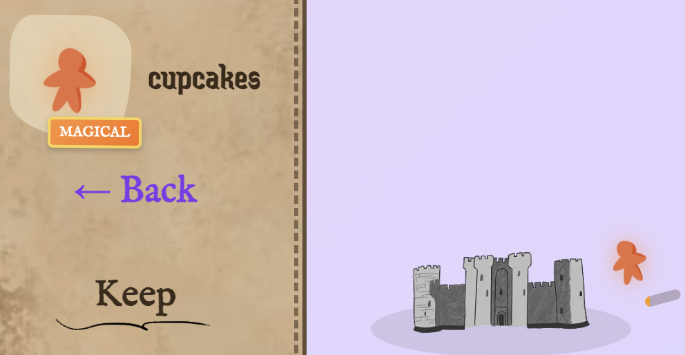
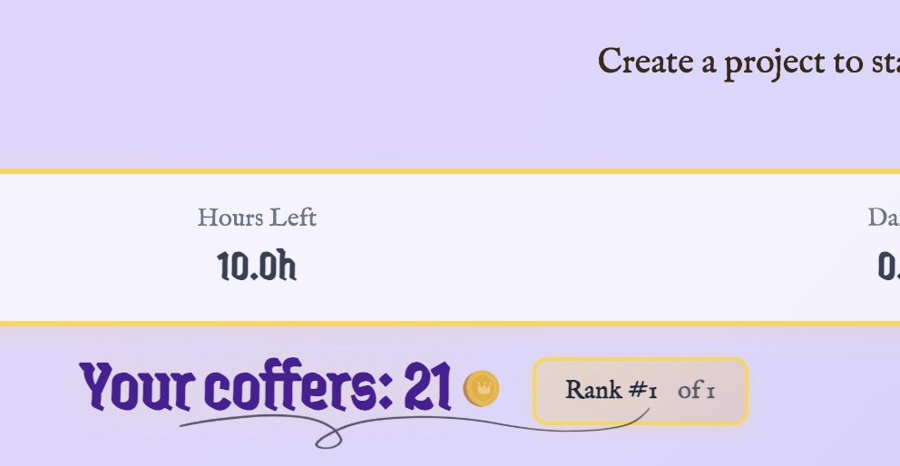
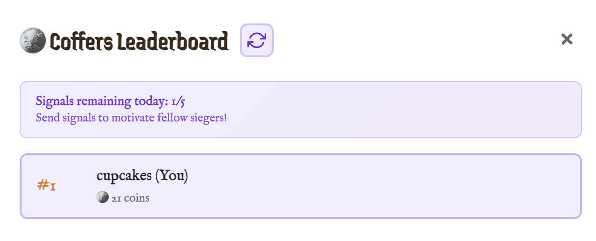
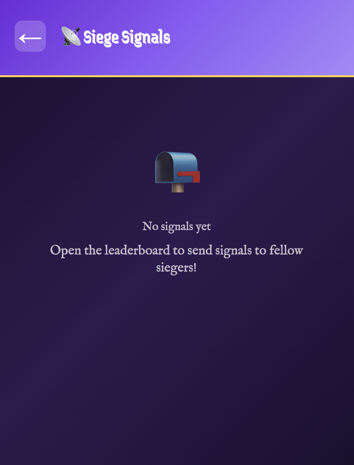
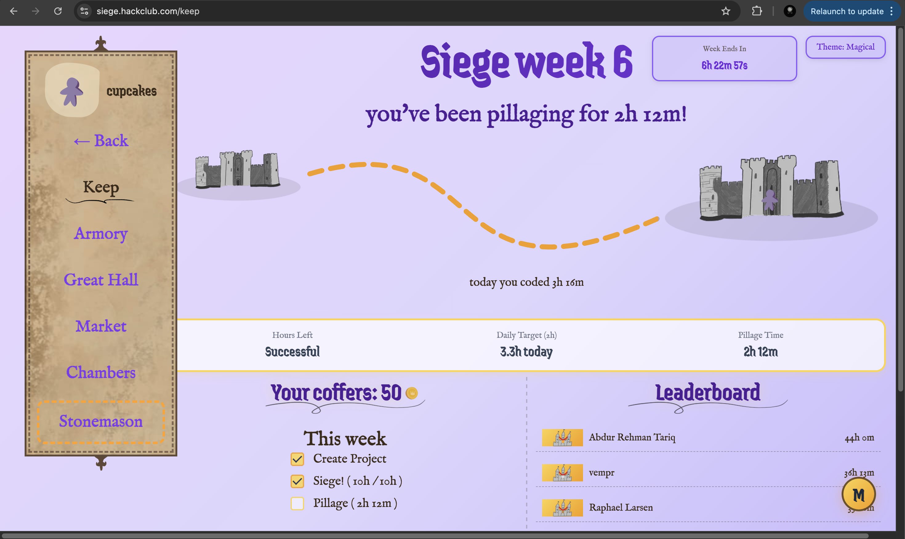
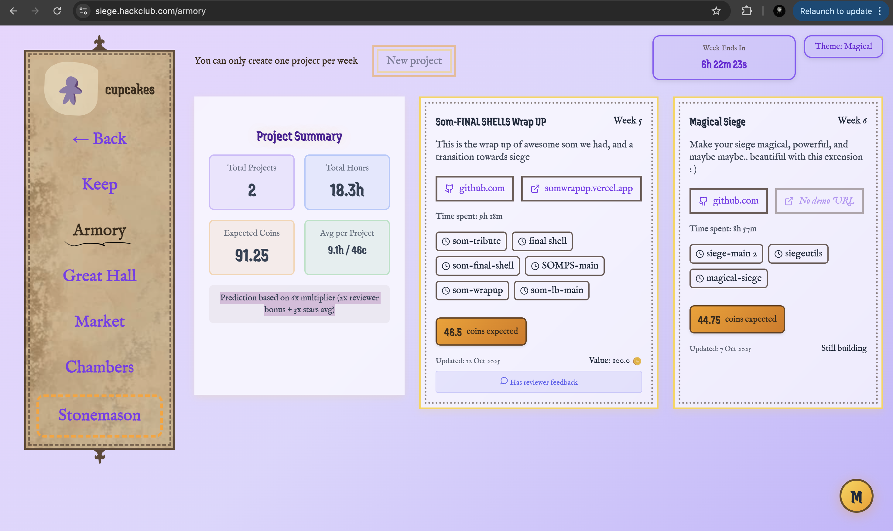

# Magical Siege

This project is an update!

week 8 update:
I have fixed the issues created duw to olive rewriting some code in og website, made armory upgrades, fixed the broken structure, and most importantly now lb uses api to fetch top 50, and then counts you (if you are not in top 50), also added search in explore page, and most amazing update in this version that i personally love is falling projects, they turned out to be so cool, you can clickable as well, hope you all like this update (prolly a final one!)

tysm for the support rino (only user apart from me lol!)

video demo:
[]
(https://www.youtube.com/watch?v=gvmhH4fzpwc)

This is a Chrome extension that transforms the Siege experience into a magical one, i have invested a lot of time in hit and trial, by trying out different ui upgrades and features, dug too deep into siege code for that :cryin: but good thing is that I have fairly good idea about siege web structure now, after multiple versions and trials, I have kinda accepted how keep and armory page have been upgraded as of now, I have also tried to make a magical theme for the website do try it out, I'll keep working on this one, to make it much more useful and upgrade siege into truly a magical experience :)

what I improved in week 7 (signal theme):
I improved themes (dont tell Olive but in magical theme you get orange meeple for free with this one :lol), added a coffers leaderboard, and a poke(signal) feature to poke others, sadly I was out this week so couldn't work much as I wanted to! Now that apis are finally out, I can't wait to use them in week 8, here are some snapshots!

---

---

---

---

Old readme (upto week 6)

---

## Features as of now (Implemented succesfully)

### Magical themes
I have implemented two more themes, magical and a dark theme do check them out :)

### Live Deadline Countdown
A live countdown according to edt, to keep you on your feet :)

### Better stats on keep
I have tried to improved the stats in keep page, so that you have better experience sieging!

### Armory upgrades
Armory page is upgraded now with predicted coins, and project stats that will help you, It's still work in progress, i am working on more features

### Keyboard shortcuts
yeah i added some keyboard shortcut as well, idk how they are better, but it seemed cool to me :)

## Future (yet to be implemented)

I did try some of these but they were broken, so I am not shipping them yet!

### Voting Tools
Vote faster and fairer with ai detection, and ai comparison for all projects for maybe better star rating

### shop upgrades
I maybe able to give some shop items for free (Olive dont kill me for that :hehe:) also a better shop layout maybe

---

## Installation

### Manual Installation (Development mode in chrome)
1. Download extension from gh releases and extract it
4. Open Chrome and go to `chrome://extensions/`
5. Enable "Developer mode"
6. Click "Load unpacked"
7. Select the `extracted` folder
